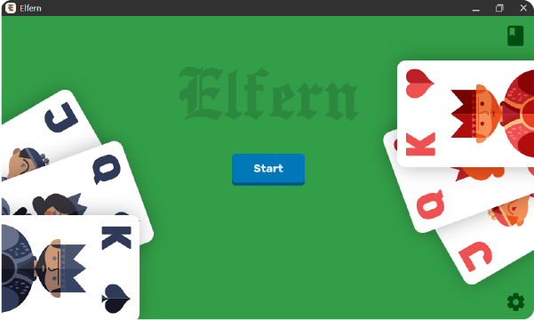
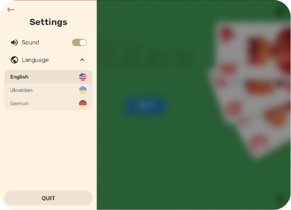
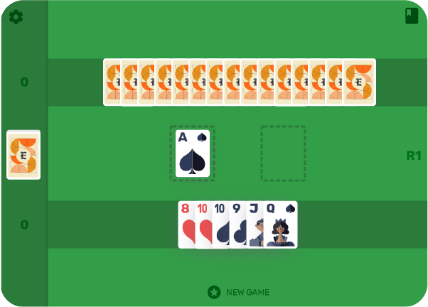
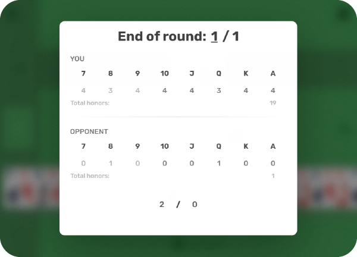
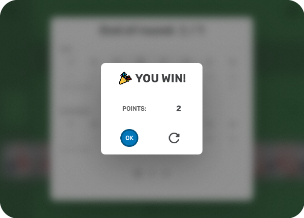

# **Elfern**: Card Game

## Description

---

_Elfern_ is an old game coming from Germany. The German word _"elfern"_ translates as _"making eleven"_, which describes the minimum target score for winning the hand - 11 points.

The game is designed for two players and traditionally uses a classic deck without sixes. Arrangement of cards in the deck (from largest to smallest): **ace, king, queen, jack, 10, 9, 8, 7**.

> #### The most important are cards from ace to 10 (so-called **_honors_**) - it is for them that points are counted: 1 point for 1 honor.

## The goal of the game

---

The aim of the game is to score as many honors as possible.

> The minimum for winning is 11 honors.

Thus, after each bribe has been played, players review the cards they managed to catch during the deal.

## The gameplay

---

At the beginning of the game, the dealer is chosen by lot. Each subsequent batch, it changes in turn.

The dealer deals 2 cards to each player three times. The remaining cards form a **stock**, from which players will take cards. The stock is placed shirt up.

The first move makes **_forehand_** (dealer's opponent): lays out the desired card. His opponent must put a card of the same suit, but of a higher rank. If there is no card of this suit - he can put any card (thus loosing the card). **_Bribe_** (initial and demolished card) is won by the player of the highest card of the leading suit. After each bribe, each player must pick up one card from the stock.

> After the stock has expired, a card of the same suit must be placed on the card (if there is such card in a hand).
>
> ### Remark
>
> Although **ace** is the highest card, it can be beaten by **7** of the same suit.

## Scoring

---

If any player manages to score

-   11 or more honors, it is considered that he won the hand _(or one game)_ and receives _1 points_;
-   15, 16, 17, 18 or 19 honors - wins double hand _(two games or **Schneider**)_ and gets _2 points_;
-   20 honors - wins the triple hand _(three games or **Schwartz**)_ and gets _3 points_.

> If both players win 10 honors during the hand, it is considered that there is no winner in this hand _(**stender**)_.

After the chosen amount of time or the number of games (rounds), the player who scored the highest number of points is declared the winner of the game.

## Gallery

## License

Elfern is licensed under the [MIT License](LICENSE)
